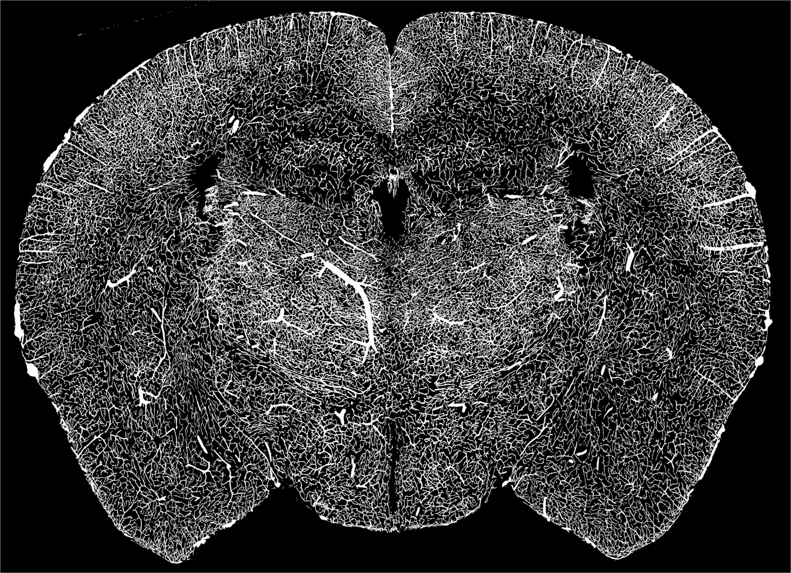
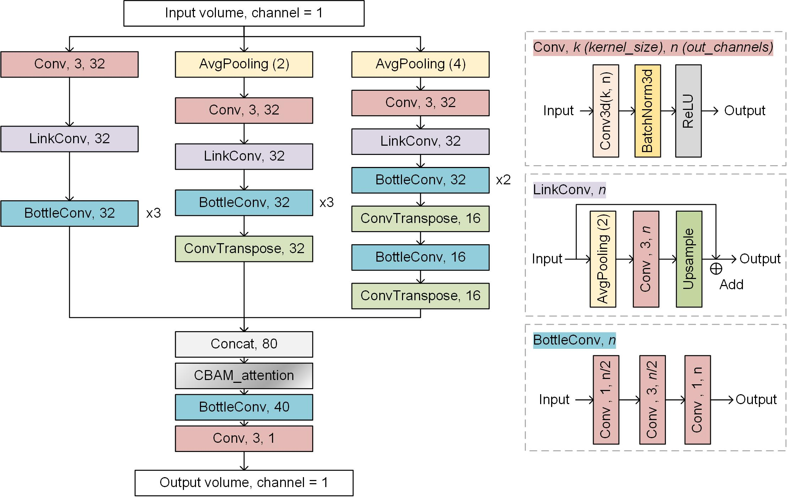
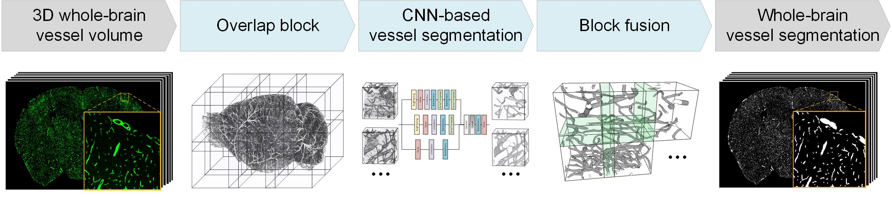

This repository contains the code for the paper "A high-performance deep-learning-based pipeline for whole-brain vasculature segmentation at the capillary resolution"



HP-VSP is a high-performance deep-learning-based pipeline for whole-brain vascular segmentation. The pipeline contains a lightweight neural network model for multi-scale vessel features extraction and segmentation, which can achieve more accurate segmentation results with only 1% of the parameters of similar methods. The pipeline uses parallel computing to improve the efficiency of segmentation and the scalability of various computing platforms.


# segmentation network
The source code of proposed segmentation network is in this folder. Users can use this network to train and segment their own vascular datasets.



- Training the network

`dataset`: path of the training dataset, the dataset should be structured like
```
data
   |-- datasets
   |-- image
       |-- img001.tif
       |-- img002.tif
       |-- ...
   |-- label
       |-- img001.tif
       |-- img002.tif
       |-- ...
   |--predataset.py
```
then, run `predataset.py` to generate the training, validation, and test set  in `dataset/datasets`.

run `data2list.py` to the data path of the training, validation, and test set.

`train_new.py` is used to train the network.


# vascular segmentation pipeline
The source code of proposed HP-VSP is in this folder. The pipeline consists of three parts: overlapping blocking, block segmentation, and blocks fusion.  Users can use this pipeline to segment large-scacle or whole-brain 3D vascular datasets.



- Resample the dataset run `mpi_resample.py`.
Two parameters need to be set before running
```
    #original 2D slices path
    src = '/lustre/ExternalData/liyuxin/dataset/hip/193882/left_merge/'
    #resampled 2D slices path
    dst = '/lustre/ExternalData/liyuxin/dataset/hip/193882/left_merge2x2x2/'
```
then, run `mpiexec -n num_proc -f nodefile python mpi_resample.py`. `num_proc` is the total number of parallels, `nodefile` is a list of the names of the specified compute nodes.

- To chunk the two-dimensional sequence dataset, run `mpi_overlap_blocking.py`.
Four parameters need to be set before running

```
    #2D slices path
    src = '/lustre/ExternalData/liyuxin/dataset/193882/2x2x2/'
    #overlapped 3D blocks save path
    dst = '/lustre/ExternalData/liyuxin/dataset/193882/block_2x2x2/'
    #size of blocks
    block_size = 192
    #size of  overlap area
    overlap = 32
```
then, run `mpiexec -n num_proc -f nodefile python mpi_overlap_blocking.py`. 

- Segment the overlaping cubes, run `parallel_segmentation.py`.
Five parameters need to be set before running
```
    #avg pixel value of dataset
    all_mean1 = np.array([40], dtype=np.float32)
    # set the uesed GPUs
    os.environ["CUDA_VISIBLE_DEVICES"] = '0,1,2,3,4,5,6,7'
    #overlapped 3D blocks path
    tiff_path = '/lustre/ExternalData/liyuxin/dataset/hip/193882/right_block/'
    #segmented blocks save path
    dst = '/lustre/ExternalData/liyuxin/dataset/hip/193882/right_seg/'
    ......
    #load pertrained network parameters
    temp = torch.load("model_pretrained.pth")
```
then, run `python parallel_segmentation.py`

- Merge the segmented blocks to generate the segmented 2D sequence data, run `mpi_block_fusion.py`.
Two parameters need to be set
```
    # segmented 3D blocks path
    src = '/lustre/ExternalData/liyuxin/dataset/hip/193882/right_seg/'
    # 2D slices save path
    dst = '/lustre/ExternalData/liyuxin/dataset/hip/193882/right_merge/'
```
then, run `mpiexec -n num_proc -f nodefile python mpi_block_fusion.py`. 


# Citation

coming soon...
